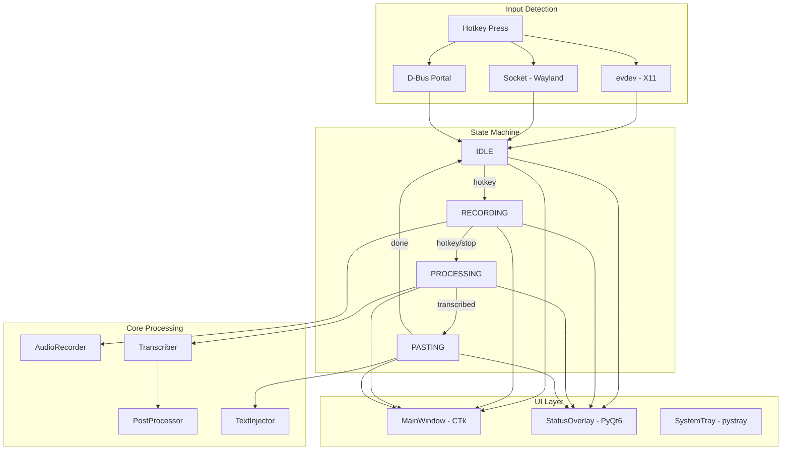

# Wayfinder Aura - Agent Documentation

> **For AI Agents**: This document provides technical context to help you understand and work with this codebase effectively. Read this before making changes.

## Quick Reference

| Command | Purpose |
|---------|---------|
| `python main.py` | Run the application |
| `pytest tests/` | Run all tests |
| `PYTHONPATH=src python -m wayfinder` | Run via package entry point |
| `./build.sh` | Build standalone executable |

---

## Project Overview

**Wayfinder Aura** is a local voice dictation application for Linux. It:

1. **Records audio** when user presses a hotkey (F9 default)
2. **Transcribes speech** using whisper.cpp or Faster-Whisper
3. **Post-processes text** with an LLM (llama.cpp, Ollama, or cloud APIs)
4. **Injects text** at the cursor position using ydotool

### Core Technologies

| Layer | Technology | Notes |
|-------|------------|-------|
| UI Framework | CustomTkinter | Dark theme, modern widgets |
| Status Overlay | PyQt6 | Glassmorphic floating indicator |
| Audio Recording | sounddevice + scipy | 16kHz resampling for Whisper |
| Transcription | whisper.cpp / Faster-Whisper | GPU acceleration via Vulkan/ROCm |
| Post-Processing | llama.cpp / Ollama | Local LLM cleanup |
| Text Injection | ydotool | Works on Wayland and X11 |
| System Tray | pystray | Background operation |
| Hotkey Detection | evdev / D-Bus | X11 and Wayland support |

---

## Architecture



### State Machine Flow

```
IDLE ──[hotkey]──► RECORDING ──[hotkey]──► PROCESSING ──[done]──► PASTING ──► IDLE
  ▲                                              │                    │
  │                                              │ [error]            │
  └──────────────────────────────────────────────┴────────────────────┘
```

| State | Description | UI Color |
|-------|-------------|----------|
| IDLE | Waiting for hotkey | Indigo (#7B8BD9) |
| RECORDING | Capturing audio | Rose (#E8707F) |
| PROCESSING | Transcribing + LLM | Gold (#E5AC2A) |
| PASTING | Injecting text | Mint (#5DD4A8) |

---

## File Structure

### Authoritative Source Files

All core logic lives in `src/wayfinder/`. **Always edit these files, not root-level files.**

```
src/wayfinder/
├── __init__.py         # Package init, version info
├── __main__.py         # Entry point for python -m wayfinder
├── app.py              # Re-exports for convenient imports
├── config.py           # Configuration management (DEFAULT_CONFIG, load/save)
├── state.py            # State machine (AppState enum, transitions)
├── license.py          # License key validation (premium features)
│
├── core/               # Core functionality
│   ├── __init__.py     # Re-exports all core modules
│   ├── recorder.py     # Audio recording (AudioRecorder, ChunkedRecorder)
│   ├── transcriber.py  # Speech-to-text (whisper.cpp, Faster-Whisper, Groq, OpenAI)
│   ├── injector.py     # Text injection via ydotool
│   ├── postprocessor.py # LLM text cleanup (llama.cpp, Ollama, Anthropic, OpenAI)
│   ├── ollama_manager.py # Ollama service management
│   └── voice_profile.py # Personal voice pattern learning
│
├── ui/                 # User interface
│   ├── __init__.py
│   ├── theme.py        # Design tokens (COLORS, FONTS, SPACING)
│   ├── components.py   # Reusable widgets (ToolTip, ModeSelector)
│   ├── overlay.py      # PyQt6 floating status indicator
│   └── dialogs/        # Dialog windows
│       ├── __init__.py
│       └── calibration.py # Audio calibration dialog
│
├── hotkeys/            # Hotkey detection
│   ├── __init__.py
│   ├── evdev.py        # Direct /dev/input monitoring (X11)
│   ├── socket.py       # Unix socket for external triggers
│   └── dbus.py         # XDG GlobalShortcuts portal (Wayland)
│
└── utils/              # Utilities
    ├── __init__.py
    ├── gpu.py          # GPU detection and info
    ├── gpu_simple.py   # Simplified GPU setup
    ├── lazy_imports.py # Deferred imports for faster startup
    ├── logging.py      # Logging utilities
    └── platform.py     # Platform detection (Wayland, Flatpak, etc.)
```

### Root-Level Files

| File | Purpose | Notes |
|------|---------|-------|
| `main.py` | **Primary entry point** | Handles Tk scaling, imports WayfinderApp |
| `wayfinder_main.py` | **Legacy monolith (14k+ lines)** | Contains WayfinderApp class and all UI |
| `build.sh` | Build script | Creates PyInstaller executable |
| `pyproject.toml` | Python packaging | Dependencies, tool configs |
| `requirements.txt` | Pip dependencies | Install with `pip install -r requirements.txt` |

### Important: Legacy Migration Status

The project is being migrated from a monolithic structure to the modular `src/wayfinder/` package.

**Current state:**
- Core modules (recorder, transcriber, injector, postprocessor) are fully migrated
- Config, state, theme, hotkeys are migrated
- `wayfinder_main.py` still contains the main WayfinderApp class and all UI dialogs
- Root shim files have been removed - all imports now use `wayfinder.*` paths

**When making changes:**
1. Core logic changes → Edit `src/wayfinder/core/*.py`
2. UI/dialog changes → Edit `wayfinder_main.py` (until dialogs are extracted)
3. Config changes → Edit `src/wayfinder/config.py`

---

## Configuration Reference

Config is stored at `~/.config/wayfinder-aura/config.json`

### Whisper Settings

| Key | Type | Default | Description |
|-----|------|---------|-------------|
| `whisper_binary` | string | `~/whisper.cpp/build/bin/whisper-cli` | Path to whisper-cli |
| `model_path` | string | `~/whisper.cpp/models/ggml-large-v3-turbo.bin` | Whisper model path |

### Hotkey Settings

| Key | Type | Default | Description |
|-----|------|---------|-------------|
| `hotkey_key` | int | `67` (F9) | evdev key code for recording toggle |
| `hotkey_modifiers` | list | `[]` | Modifier keys (ctrl, alt, shift, super) |
| `style_toggle_key` | int | `68` (F10) | Key to cycle output styles |
| `style_toggle_modifiers` | list | `[]` | Modifiers for style toggle |

### Audio Settings

| Key | Type | Default | Description |
|-----|------|---------|-------------|
| `audio_device` | int/null | `null` | Audio input device index (null = auto) |
| `sample_rate` | int | `16000` | Sample rate (16kHz for Whisper) |
| `min_recording_duration` | float | `0.5` | Minimum recording length in seconds |

### Transcription Settings

| Key | Type | Default | Description |
|-----|------|---------|-------------|
| `transcription_backend` | string | `whisper_cpp` | `whisper_cpp`, `faster_whisper`, `groq_whisper`, `openai_whisper` |
| `threads` | int | `4` | CPU threads for whisper.cpp |
| `timeout` | int | `120` | Transcription timeout in seconds |
| `beam_size` | int | `5` | Beam search width (1-10) |
| `language` | string | `en` | Language code or `auto` |
| `accuracy_mode` | string | `balanced` | `fast`, `balanced`, `high` |
| `audio_preprocessing` | string | `light` | `off`, `light`, `medium`, `heavy` |

### Chunked Recording

| Key | Type | Default | Description |
|-----|------|---------|-------------|
| `chunked_mode` | bool | `true` | Enable chunked recording |
| `chunk_duration` | int | `15` | Seconds per chunk |
| `chunk_overlap` | int | `2` | Overlap between chunks |
| `max_recording_duration` | int | `0` | Max duration (0 = unlimited) |

### GPU Settings

| Key | Type | Default | Description |
|-----|------|---------|-------------|
| `use_gpu` | bool | `true` | Enable GPU acceleration |
| `gpu_layers` | int | `0` | GPU layers (0 = all) |
| `gpu_device` | string | `auto` | GPU device (`auto`, `0`, `1`, `2`) |

### Post-Processing (LLM)

| Key | Type | Default | Description |
|-----|------|---------|-------------|
| `post_processing_enabled` | bool | `true` | Enable LLM cleanup |
| `post_processing_backend` | string | `llama_cpp` | `llama_cpp`, `ollama`, `anthropic`, `openai` |
| `output_tone` | string | `professional` | `minimal`, `professional`, `casual`, `dev`, `personal` |
| `strong_mode` | bool | `false` | Allow sentence restructuring |
| `llama_cpp_model_path` | string | (see config.py) | Path to GGUF model |
| `ollama_model` | string | `qwen2.5:1.5b` | Ollama model name |

### UI Settings

| Key | Type | Default | Description |
|-----|------|---------|-------------|
| `typing_speed` | string | `instant` | `instant`, `fast`, `normal`, `slow`, `very_slow` |
| `start_minimized` | bool | `false` | Start in system tray |
| `overlay_type` | string | `always_on` | `always_on` (PyQt6), `disappearing` (CTk) |
| `overlay_scale` | float | `0.7` | Status overlay scale (0.5-2.0) |

---

## Module Guide

### `wayfinder.core.recorder`

**Purpose**: Audio recording with automatic resampling to 16kHz.

**Key Classes**:
- `AudioRecorder` - Basic recording with sounddevice
- `ChunkedRecorder` - Long recordings split into overlapping chunks
- `AudioCalibrator` - Microphone calibration utility

**Key Functions**:
- `find_best_input_device(preferred_name)` - Auto-detect best microphone
- `list_input_devices()` - List all audio inputs
- `preprocess_audio(data, level)` - Apply noise reduction

### `wayfinder.core.transcriber`

**Purpose**: Speech-to-text with multiple backends.

**Key Classes**:
- `WhisperCppBackend` - whisper.cpp CLI (supports Vulkan GPU)
- `FasterWhisperBackend` - CTranslate2-based (supports ROCm/CUDA)
- `GroqWhisperBackend` - Groq cloud API (ultra-fast)
- `OpenAIWhisperBackend` - OpenAI Whisper API

**Key Function**:
- `transcribe_with_config(audio_path, config, context)` - Main transcription entry point

### `wayfinder.core.postprocessor`

**Purpose**: Clean up transcription with LLM.

**Key Classes**:
- `LlamaCppBackend` - llama.cpp CLI or Python bindings
- `OllamaBackend` - Ollama REST API
- `AnthropicBackend` - Claude API
- `OpenAIBackend` - GPT API

**Key Functions**:
- `process_with_config(text, config, voice_profile)` - Main post-processing entry point
- `get_available_backends()` - List available LLM backends
- `check_settings_compatibility(config)` - Validate settings

### `wayfinder.core.injector`

**Purpose**: Type text at cursor position.

**Key Function**:
- `inject_text(text, typing_speed)` - Inject via ydotool

**Typing Speeds**: `instant` (0ms), `fast` (1ms), `normal` (12ms), `slow` (50ms), `very_slow` (100ms)

### `wayfinder.hotkeys`

**Purpose**: Detect global hotkeys across X11 and Wayland.

**Methods**:
1. `evdev` - Direct `/dev/input` monitoring (X11, needs input group)
2. `socket` - Unix socket at `/tmp/wayfinder-aura.sock` (Wayland)
3. `dbus` - XDG GlobalShortcuts portal (Wayland, experimental)

### `wayfinder.ui.theme`

**Purpose**: Design system tokens.

**Key Constants**:
- `COLORS` - Color palette (bg_base, accent, state colors)
- `FONTS` - Font families (display, body, mono)
- `FONT_SIZES` - Size tokens (display, title, body, etc.)
- `SPACING` - Layout spacing (gutter, padding)
- `RADIUS` - Corner radius (sm, md, lg, xl)

---

## Common Pitfalls

### 1. Import Paths

**Wrong**: `from recorder import AudioRecorder`  
**Right**: `from wayfinder.core.recorder import AudioRecorder`

All imports should use `wayfinder.*` package paths.

### 2. wayfinder_main.py is Legacy

The 14k+ line `wayfinder_main.py` contains the main app class. Until migration is complete, UI changes go there.

### 3. GPU Setup Order

GPU environment must be set up BEFORE importing GPU-using modules:

```python
# In main.py - this order matters
from wayfinder.utils.gpu_simple import setup_gpu_environment
from wayfinder.config import load_config
config = load_config()
setup_gpu_environment(config)  # THEN import GPU modules
```

### 4. Tk Scaling Issues

Some displays cause Tk scaling errors. `main.py` handles this with a cached scaling value.

### 5. Wayland vs X11 Hotkeys

- **X11**: evdev works directly
- **Wayland**: Must use socket method with KDE shortcut calling `trigger_record.py`

### 6. ydotool Socket

ydotool needs its daemon running. Check socket at `/run/ydotool/ydotool.sock`.

### 7. Config Duplication

`DEFAULT_CONFIG` appears in both `wayfinder_main.py` and `src/wayfinder/config.py`. The authoritative version is `src/wayfinder/config.py`.

---

## Testing

### Running Tests

```bash
# Run all tests
pytest tests/

# Run with verbose output
pytest tests/ -v

# Run specific test file
pytest tests/test_config.py

# Run with coverage
pytest tests/ --cov=src/wayfinder
```

### Test Files

| File | Tests |
|------|-------|
| `test_config.py` | Config load/save, defaults |
| `test_state.py` | State machine transitions |
| `test_recorder.py` | Audio recording functions |
| `test_transcriber.py` | Transcription backends |
| `test_license.py` | License validation |
| `test_integration.py` | End-to-end flows |

### Key Fixtures (conftest.py)

- `temp_dir` - Temporary directory for test files
- `temp_config_dir` - Temporary config directory with patched HOME
- `sample_config` - Sample configuration dict
- `sample_audio_file` - Creates a minimal WAV file

---

## Debugging

### Check What's Running

```bash
# See if app is running
pgrep -f wayfinder

# Check ydotool daemon
ls -la /run/ydotool/

# Check socket exists
ls -la /tmp/wayfinder-aura.sock
```

### Test Individual Components

```bash
# Test package imports
PYTHONPATH=src python -c "from wayfinder.core import AudioRecorder; print('OK')"

# Test transcriber
PYTHONPATH=src python -c "from wayfinder.core.transcriber import get_backend; print(get_backend('whisper_cpp', {}))"

# Test GPU detection
PYTHONPATH=src python -c "from wayfinder.utils.gpu import detect_gpu; print(detect_gpu())"
```

### Logs

The app logs to stdout. For debugging:

```bash
python main.py 2>&1 | tee wayfinder.log
```

---

## Making Changes

### Adding a New Config Option

1. Add to `DEFAULT_CONFIG` in `src/wayfinder/config.py`
2. Add UI control in `wayfinder_main.py` (search for similar settings)
3. Use with `config.get("your_option", default_value)`

### Adding a New Transcription Backend

1. Create class inheriting from `TranscriptionBackend` in `transcriber.py`
2. Implement `transcribe()`, `is_available()`, `get_name()`, `supports_gpu()`
3. Add to `get_backend()` factory function
4. Add backend option to config

### Adding a New Post-Processing Backend

1. Create class inheriting from `PostProcessorBackend` in `postprocessor.py`
2. Implement `process()`, `is_available()`, `get_name()`
3. Add to `get_backend()` factory function
4. Add backend option to config

---

## Related Documentation

- [README.md](README.md) - User-facing documentation
- [DEVELOPMENT.md](DEVELOPMENT.md) - Developer setup guide
- [src/wayfinder/MIGRATION.md](src/wayfinder/MIGRATION.md) - Migration status
- [flatpak/BUILDING.md](flatpak/BUILDING.md) - Flatpak packaging
